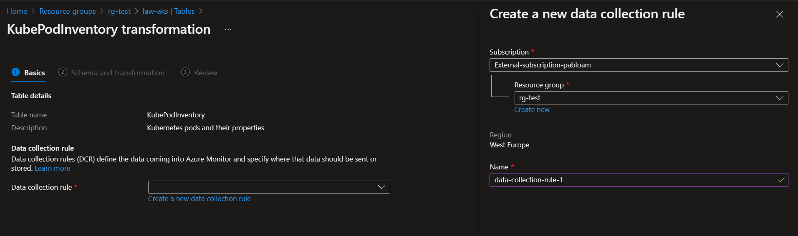

# Prerequisites

Create an Azure Resource Group and a simple AKS cluster with the following commands.

```Bash
AKS_RESOURCE_GROUP="rg-test"
az group create -n $AKS_RESOURCE_GROUP -l westeurope
AKS_NAME_1="aks-cluster-1"
az aks create --node-count 3 --name $AKS_NAME_1 --resource-group $AKS_RESOURCE_GROUP --generate-ssh-keys
KUBE_FILE="$HOME/aks-cluster-1.config"
az aks get-credentials \
    --name $AKS_NAME_1 \
    --resource-group $AKS_RESOURCE_GROUP \
    --admin \
    --file "$KUBE_FILE"
export KUBECONFIG=$KUBE_FILE
```

# Activity Logs

Create a Log Analytics workspace for the Activity Logs.

```Bash
az monitor log-analytics workspace create \
  --resource-group $AKS_RESOURCE_GROUP \
  --workspace-name law-activity-logs
```

Go to the portal to enable the Activity Logs.


Go to the **law-activity-logs** Log Analytics workspace in logs section and run the following KQL.

> **NOTE: You should run the KQL in the final of this demo since if there is not activity in the resource group you won't see nothing**.


```KQL
AzureActivity
| where CategoryValue == "Administrative" and ResourceGroup == "rg-test"
```

# Azure Diagnostic Setting

Create a Log Analytics workspace for AKS.

```Bash
az monitor log-analytics workspace create \
  --resource-group $AKS_RESOURCE_GROUP \
  --workspace-name law-aks
```

Go to the AKS Diagnostic Settings.


Go to the **law-aks** Log Analytics workspace in logs section and run the following KQL.

> **NOTE: Show all available categories and the number of events**.

```KQL
AzureDiagnostics
| where TimeGenerated > ago(24h)
| summarize count() by Category
| sort by Category
```


> **NOTE: The distribution of verbs used in the last 24 hours**.

```KQL
AzureDiagnostics
| where Category == "kube-audit"
| where TimeGenerated > ago(24h)
| extend verb_ = tostring(parse_json(log_s).verb)
| summarize count() by verb_
| project count_, verb_
| render piechart
```


# Kubelet logs

```Bash
NODE_NAME=$(kubectl get nodes --output name | head -n 1)
kubectl debug $NODE_NAME -it --image=mcr.microsoft.com/dotnet/runtime-deps:6.0
```


# Container insights

## Collect Prometheus metrics with Container insights

Enable Container insights.


> **NOTE: We are no going to use Grafana in this section because this example is done in the [Collect Prometheus metrics from AKS cluster (preview)](#Collect-Prometheus-metrics-from-AKS-cluster-(preview)) section**.

[Download](https://aka.ms/container-azm-ms-agentconfig) the template ConfigMap YAML file and save it as **container-azm-ms-agentconfig.yaml**.

Edit the ConfigMap YAML file with your customizations to scrape Prometheus metrics. For example, to collect Kubernetes services cluster-wide, configure the ConfigMap file by using the following example.

```TXT
prometheus-data-collection-settings: |- ​
# Custom Prometheus metrics data collection settings
[prometheus_data_collection_settings.cluster] ​
interval = "1m"  ## Valid time units are s, m, h.
fieldpass = ["metric_to_pass1", "metric_to_pass12"] ## specify metrics to pass through ​
fielddrop = ["metric_to_drop"] ## specify metrics to drop from collecting
kubernetes_services = ["http://my-service-dns.my-namespace:9102/metrics"]
```

Create the configmap.

```Bash
kubectl apply -f container-azm-ms-agentconfig.yaml
```

Go to the **law-aks** Log Analytics workspace in logs section and run the following KQL.

> **NOTE: The following example is a Prometheus metrics query showing disk reads per second per disk per node.**.

```KQL
InsightsMetrics
| where Namespace == 'container.azm.ms/diskio'
| where TimeGenerated > ago(1h)
| where Name == 'reads'
| extend Tags = todynamic(Tags)
| extend HostName = tostring(Tags.hostName), Device = Tags.name
| extend NodeDisk = strcat(Device, "/", HostName)
| order by NodeDisk asc, TimeGenerated asc
| serialize
| extend PrevVal = iif(prev(NodeDisk) != NodeDisk, 0.0, prev(Val)), PrevTimeGenerated = iif(prev(NodeDisk) != NodeDisk, datetime(null), prev(TimeGenerated))
| where isnotnull(PrevTimeGenerated) and PrevTimeGenerated != TimeGenerated
| extend Rate = iif(PrevVal > Val, Val / (datetime_diff('Second', TimeGenerated, PrevTimeGenerated) * 1), iif(PrevVal == Val, 0.0, (Val - PrevVal) / (datetime_diff('Second', TimeGenerated, PrevTimeGenerated) * 1)))
| where isnotnull(Rate)
| project TimeGenerated, NodeDisk, Rate
| render timechart
```


## Test Live Data with view logs

Create the following counter pod.

```Bash
kubectl apply -f - <<EOF
apiVersion: v1
kind: Pod
metadata:
  name: counter
spec:
  containers:
  - name: counter
    image: nginx
    command: ["/bin/bash"]
    args: ["-c", "for i in {1..999} ; do echo 'Hello World!' ; sleep 1; done"]
EOF
```

Go to Container Insights and search the counter pod and click on Live Logs.


## Data collection - Transformations

AKS tables that support transformations in Azure Monitor Logs (any custom table supports transformations):

- [KubeEvents](https://learn.microsoft.com/en-us/azure/azure-monitor/reference/tables/kubeevents)
- [KubeHealth](https://learn.microsoft.com/en-us/azure/azure-monitor/reference/tables/kubehealth)
- [KubeMonAgentEvents](https://learn.microsoft.com/en-us/azure/azure-monitor/reference/tables/kubemonagentevents)
- [KubeNodeInventory](https://learn.microsoft.com/en-us/azure/azure-monitor/reference/tables/kubenodeinventory)
- [KubePodInventory](https://learn.microsoft.com/en-us/azure/azure-monitor/reference/tables/kubepodinventory)
- [KubeServices](https://learn.microsoft.com/en-us/azure/azure-monitor/reference/tables/kubeservices)

Lets do the transformations for KubePodInventory table.





Let's assume that we only want the logs of the **kube-system** namespace.


Review and Create.

## Enable cost optimization settings

You can set the interval ([1m, 30m]), namespaceFilteringMode (Include, Exclude, or Off) and namespaces [An array of names i.e. ["kube-system", "default"]]. For more info [here](https://review.learn.microsoft.com/en-us/azure/azure-monitor/containers/container-insights-cost-config?branch=pr-en-us-210933&tabs=create-CLI#data-collection-parameters).

Example:

Create the following dataCollectionSettings.json file.

```Bash
cat > dataCollectionSettings.json << EOF
{
  "interval": "1m",
  "namespaceFilteringMode": "Include",
  "namespaces": ["kube-system"]
}
EOF
```

```Bash
az aks enable-addons -a monitoring --enable-msi-auth-for-monitoring \
    --name $AKS_NAME_1 \
    --resource-group $AKS_RESOURCE_GROUP \
    --data-collection-settings dataCollectionSettings.json
```

# Collect Prometheus metrics from AKS cluster (preview)

## Create new AKS cluster for this section

```Bash
AKS_RESOURCE_GROUP="rg-test"
az group create -n $AKS_RESOURCE_GROUP -l westeurope
AKS_NAME_2="aks-cluster-2"
az aks create --node-count 3 --name $AKS_NAME_1 --resource-group $AKS_RESOURCE_GROUP --generate-ssh-keys
KUBE_FILE="$HOME/aks-cluster-2.config"
az aks get-credentials \
    --name $AKS_NAME_2 \
    --resource-group $AKS_RESOURCE_GROUP \
    --admin \
    --file "$KUBE_FILE"
export KUBECONFIG=$KUBE_FILE
```

## Prometheus intro

Prometheus is a whitebox monitoring system, it is necessary to integrate it within the applications, so that they expose the metrics and it can obtain them.
Prometheus features:
- System and business metrics.
- Robust and efficient, high availability.
- Efficient, a single server can handle millions of metrics.
- Integrated service discovery, with practically no effort you can connect to our applications to monitor them.
- Practically full integration with Kubernetes.

The monitoring architecture is different from other monitoring systems, in which the systems themselves are monitored, either by themselves or by agents that send this data to the monitoring systems. Prometheus looks for data in each service, asks what metrics it has and gets them.


- Service discovery: discover services
- Storage: the database
- Query system: to connect with Grafana
- Exporter: used for applications to convert their metrics format to a Prometheus metrics format.
- Alerts: only for routing the notifications to the destination endpoints, email, slack etc. Prometheus generates the alert, the alert manager only organizes them and sends them to their final destinations.

When we say that Prometheus will fetch the metrics from the services in a specific format, what is meant is that the services expose the metrics to Prometheus in a specific format, it is a format like plain text that is propagated by http. Actually what Prometheus does is an http request to an endpoint that the application has, and in that endpoint it exposes something like the text in the image below. 


This image is listing all the metrics that an application is exposing, in a format where it tells you for example, the description of the metric, the type of metric and then the values of the metric (#HELP is the description of metric and #Type is the type of metric). In this case, we have in the first of the metrics a counter that is called go_gc_duration_seconds and has several values. Why does it have several values? it is because each metric has different labels (quantile="0", quantile="0.25" etc.) and for each of them has a different value.

To visualize everything that prometheus stores in its database, we are going to use Grafana. With Grafana we will use diferent dashboards:

- Counter: can only be incremented or reset.
- Gauge: can be incremented or decremented.
- Histogram: values grouped in buckets.
- Summary: Average times and percentiles

Kubernetes has many metrics that we can expose with various exporters:

- [cAdvisor](https://github.com/google/cadvisor): It is responsible for exposing all types of metrics related to containers.
- [kube-state-metrics](https://github.com/kubernetes/kube-state-metrics): It is responsible for exposing metrics related to the cluster and its operations.
- Custom metrics of our applications: To do this we instrument our application with the appropriate Prometheus library. We will expose the metrics with a HTTP endpoint. It has Go, Java, Scala, Python, Ruby clients and no-official clients: Bash, PHP, Node.js etc.

## Prometheus demo

### Flask Application

The only thing that our application does is to add a counter, we are going to add a counter so that each time that it is going to redis tell us if it has gone OK or NOT.

We need to use the Prometheus Python Client.

```Python
from prometheus_client import start_http_server, Counter
```

We need to expose the metrics by http in a specific port, so Prometheus metrics will be exposed in 8000 port

```Python
start_http_server(8000)
```

Testing the flask app locally:

```Python
cd flask-app/
sudo apt install python3-pip
sudo apt install python3-flask
sudo pip install redis
pip install json-logging
pip install prometheus-client
REDIS_PASSWORD="" REDIS_HOST="" flask run
```
Lets access the aplication in localhost:5000, it will fail but it is just to show the failed metrics in localhost:8000.


These are the metrics that my application exposes, a series of metrics that it exposes by default, they are metrics of the python garbage collector, that it automatically generates them for us, then the version of Python that is executing it... But we have the counter metris as well (below the fail that we have forced, the number is 2, because we have called the page twice). We can see this custom metric because we have a counter with label in the app conde:

```Python
c = Counter("redis_calls", "Number of calls to redis", ["status"])
```

If it goes OK we increment the counter.

```Python
c.labels(status="success").inc()
```

If it goes NO OK we increment the counter, but giving a failure status.

```Python
c.labels(status="failure").inc()
```

### Deploy Flask Application in AKS

Create ACR and flask-app image and push flask-app image to ACR.

```Bash
guid=$(cat /dev/urandom | tr -dc 'a-z0-9' | fold -w 4 | head -n 1)
az acr create --name "acrk8s$guid" \
    --resource-group $AKS_RESOURCE_GROUP \
    --sku Standard
az acr login -n acrk8s$guid
docker build -t acrk8s$guid.azurecr.io/flask-counter:latest .
docker push acrk8s$guid.azurecr.io/flask-counter:latest
```

Allow AKS Cluster access to Azure Container Registry.

```Bash
az aks update --name $AKS_NAME_2 --resource-group $AKS_RESOURCE_GROUP --attach-acr acrk8s$guid
```

Deploy flask app in K8s cluster

```Bash
sed "s/<acr-name>/acrk8s$guid/g" flask-deployment.yaml.template > k8s/flask-deployment.yaml
kubectl create ns flask-counter
kubectl create secret generic redis --from-literal=password=Pa$$word1234! -n flask-counter
kubectl apply -f k8s/ -n flask-counter
```

[Create Grafana workspace](https://learn.microsoft.com/en-us/azure/managed-grafana/quickstart-managed-grafana-portal)

[Create an Azure Monitor workspace](https://learn.microsoft.com/en-us/azure/azure-monitor/essentials/azure-monitor-workspace-manage?tabs=azure-portal#create-an-azure-monitor-workspace)

[Enable Prometheus metric collection](https://learn.microsoft.com/en-us/azure/azure-monitor/essentials/prometheus-metrics-enable?tabs=azure-portal#enable-prometheus-metric-collection)

Create ama configmap for prometheus metrics.

- _Validate the scrape config file (optional)._

    ```Bash
    # Obtain validator
    for podname in $(kubectl get pods -l rsName=ama-metrics -n=kube-system -o json | jq -r '.items[].metadata.name'); do kubectl cp -n=kube-system "${podname}":/opt/promconfigvalidator ./promconfigvalidator;  kubectl cp -n=kube-system "${podname}":/opt/microsoft/otelcollector/collector-config-template.yml ./collector-config-template.yml; chmod 500 promconfigvalidator; done
    # Validate prometheus-config
    ./promconfigvalidator/promconfigvalidator --config "./prometheus-config" --otelTemplate "./promconfigvalidator/collector-config-template.yml"
    ```
- Deploy the configmap.

    ```Bash
    kubectl create configmap ama-metrics-prometheus-config --from-file=prometheus-config -n kube-system
    ```
    For more information about the configmap file click [here](https://learn.microsoft.com/en-us/azure/azure-monitor/essentials/prometheus-metrics-scrape-configuration#pod-annotation-based-scraping).

Go to the prometheus server to review the targets.

```Bash
kubectl get pods -n kube-system | grep ama-metrics
kubectl port-forward ama-metrics-574f64fb55-gh4vb -n kube-system 9090
```


We can see the kubernetes-pods target because we have the following labels in our flask-app deployment.

```Yaml
prometheus.io/scrape: "true"
prometheus.io/path: "/metrics"
prometheus.io/port: "8000"
```

### Grafana Dashboard

Refresh your navigator tab to create some metrics.


[Create Prometheus data source](https://learn.microsoft.com/en-us/azure/azure-monitor/essentials/prometheus-grafana#create-prometheus-data-source)

Create a Grafana Dashboard to see our custom metrics


# Delete demo resources

```Bash
az group delete -n $AKS_RESOURCE_GROUP -y
```